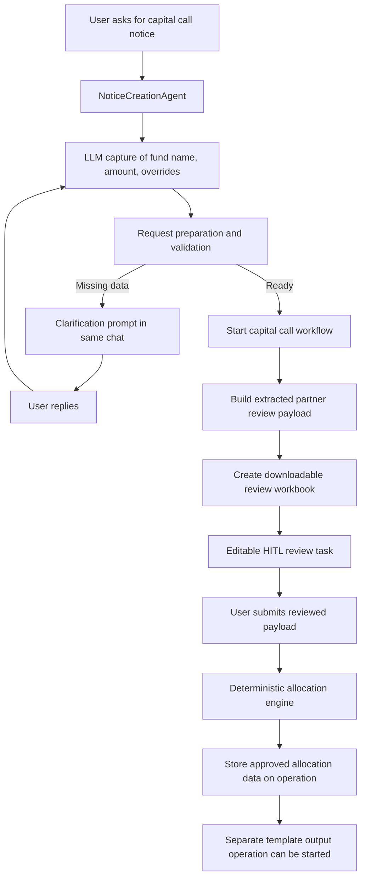

# Capital Call Notice Flow

This document explains the current capital call flow in the sample project.

It covers:

- happy path
- clarification loop
- editable human review
- template-output handoff
- uploaded vs generated files

## 1. Purpose

The `Capital Call Notice` capability lets a user ask for a capital call in chat and drive it through four stages:

1. capture request inputs in chat
2. resolve partner and feeder data from a provider or uploaded CSV
3. pause for human review of the extracted partner data
4. compute approved allocations and hand them to a separate template-output operation

The capital call workflow no longer creates the final template artifact itself. That is now a reusable downstream operation.

## 2. Inputs

### Mandatory business inputs

- `fundName`
- `capitalCallAmount`

### Optional inputs

- `noticeDate`
- partner-level commitment overrides

### Required data source

In addition to `fundName` and `capitalCallAmount`, the workflow needs one source of partner data:

- a tenant-configured provider
- or an uploaded source file

Current source modes:

- `SaaS`
- `AttachmentFile`
- `Mcp` is still just an abstraction point for future work

If no provider is configured, a file is required.

## 3. Current Design Boundary

The flow is intentionally split into three layers.

### A. Intake and clarification

This happens before the workflow starts.

Responsibilities:

- extract structured request data from chat
- merge follow-up clarifications into request state
- resolve provider vs attachment mode
- validate that the request is complete enough to start

### B. Capital call workflow

This uses Microsoft Agent Framework workflows and now runs in this order:

1. load normalized request state
2. build extracted partner / feeder review payload
3. pause for editable human review
4. compute deterministic allocations from the reviewed payload
5. complete with approved allocation data

### C. Template output operation

This is a separate reusable operation.

Responsibilities:

- take approved workflow data from another operation
- render it into an output workbook/template
- store the generated artifact

## 4. Human-in-the-Loop Model

The shared review system now supports different interaction modes.

Current modes:

- `ApproveReject`
- `EditAndSubmit`

Capital call uses `EditAndSubmit`.

That means the user does not just approve or reject. They can:

- inspect extracted partner data
- change commitment percentages
- adjust feeder nodes in the payload
- submit the edited payload back into the workflow

The submitted payload becomes the authoritative input for the allocation engine.

## 5. High-Level Flow

## 6. Happy Path

### Example

User says:

`Create a capital call notice for Apex Fund I for INR 1000`

### Step-by-step

1. Chat routes the message to [NoticeCreationAgent.cs](/Users/naveenkumarpatil/Documents/orchestrator%20design/backend/src/Domain/ConversationalOrchestration.FundAdministration/Agents/NoticeCreationAgent.cs).
2. [CapitalCallConversationIntelligence.cs](/Users/naveenkumarpatil/Documents/orchestrator%20design/backend/src/Domain/ConversationalOrchestration.FundAdministration/CapitalCalls/CapitalCallConversationIntelligence.cs) extracts `fundName` and `capitalCallAmount`.
3. [CapitalCallRequestPreparationService](/Users/naveenkumarpatil/Documents/orchestrator%20design/backend/src/Domain/ConversationalOrchestration.FundAdministration/CapitalCalls/CapitalCallExecutionServices.cs) resolves the source mode and validates the root fund tree.
4. The dispatcher starts [CapitalCallNoticeWorkflowDefinition.cs](/Users/naveenkumarpatil/Documents/orchestrator%20design/backend/src/Domain/ConversationalOrchestration.FundAdministration/Workflows/CapitalCallNoticeWorkflowDefinition.cs).
5. The workflow builds a `CapitalCallExtractionReviewPayload`.
6. A review workbook is generated from the extracted partner/feeder data.
7. The workflow pauses on an editable review task.
8. The user reviews the extracted JSON or workbook and submits corrections.
9. The workflow resumes and the deterministic allocation engine computes approved allocations.
10. The completed operation stores:
   - original request state
   - reviewed extraction payload
   - approved allocation DTO
   - review workbook metadata
11. The agent returns an action to start the reusable `Template Output` operation.

## 7. Clarification Loop

### Example

User says:

`Create a capital call notice for Apex Fund I`

The amount is missing.

### Behavior

1. Intake captures only `fundName`.
2. Request preparation sees `capitalCallAmount` is missing.
3. The operation becomes `ClarificationRequired`.
4. The user is asked for the missing data in the same thread.
5. On reply, the same operation continues and merges the new patch into request state.
6. This repeats until:
   - the fund name is resolved
   - the amount is present
   - a provider or source file is available

Clarification happens before workflow execution.

## 8. Editable Review Step

The capital call review task is created from the workflow pending request and is configured as:

- `TaskType = CapitalCallExtractionReview`
- `InteractionMode = EditAndSubmit`

The review payload contains:

- request state JSON
- root fund
- feeder tree
- partner names
- partner currencies
- commitment percentages
- review workbook metadata

The user can submit edited JSON. The review service validates that the submitted payload is valid JSON before resuming the workflow.

The review UI now supports both response styles:

- natural-language change request
- advanced raw-payload edit

Natural-language changes are applied through the shared review-payload revision service before the workflow resumes, so this pattern can be reused by future agents too.

## 9. Deterministic Allocation Rules

Once reviewed data is submitted, the allocation engine:

- recurses through feeder funds
- enforces a max depth of 10
- detects feeder cycles
- converts currency only at feeder-fund boundaries
- computes `partner amount = partner commitment % * fund amount`
- rounds to 2 decimals
- settles residual cents to the last partner after deterministic sorting

The allocation engine uses the reviewed extraction payload, not the original provider snapshot.

## 10. Separate Template Output Operation

Capital call no longer materializes the final workbook inside the workflow.

Instead:

- the capital call operation finishes with approved allocation data
- the user can trigger [TemplateOutputAgent.cs](/Users/naveenkumarpatil/Documents/orchestrator%20design/backend/src/Domain/ConversationalOrchestration.FundAdministration/Agents/TemplateOutputAgent.cs)
- that agent reads the approved capital call data and generates the final workbook

This makes template rendering reusable across future workflows.

## 11. Uploaded vs Generated Files

Conversation files now carry an explicit kind:

- `UploadedInput`
- `GeneratedArtifact`

Examples:

- uploaded CSV source file = `UploadedInput`
- generated extraction review workbook = `GeneratedArtifact`
- generated template output workbook = `GeneratedArtifact`

The UI shows these separately so users can clearly distinguish:

- files they provided
- files the system produced

## 12. Main Code Paths

### Agent and dispatcher

- [NoticeCreationAgent.cs](/Users/naveenkumarpatil/Documents/orchestrator%20design/backend/src/Domain/ConversationalOrchestration.FundAdministration/Agents/NoticeCreationAgent.cs)
- [FundAdministrationWorkflowDispatcher.cs](/Users/naveenkumarpatil/Documents/orchestrator%20design/backend/src/Domain/ConversationalOrchestration.FundAdministration/Workflows/FundAdministrationWorkflowDispatcher.cs)

### Intake and preparation

- [CapitalCallConversationIntelligence.cs](/Users/naveenkumarpatil/Documents/orchestrator%20design/backend/src/Domain/ConversationalOrchestration.FundAdministration/CapitalCalls/CapitalCallConversationIntelligence.cs)
- [CapitalCallExecutionServices.cs](/Users/naveenkumarpatil/Documents/orchestrator%20design/backend/src/Domain/ConversationalOrchestration.FundAdministration/CapitalCalls/CapitalCallExecutionServices.cs)

### Workflow

- [CapitalCallNoticeWorkflowDefinition.cs](/Users/naveenkumarpatil/Documents/orchestrator%20design/backend/src/Domain/ConversationalOrchestration.FundAdministration/Workflows/CapitalCallNoticeWorkflowDefinition.cs)
- [WorkflowRuntime.cs](/Users/naveenkumarpatil/Documents/orchestrator%20design/backend/src/Framework/ConversationalOrchestration.Infrastructure/Workflows/WorkflowRuntime.cs)

### Review model

- [ReviewModels.cs](/Users/naveenkumarpatil/Documents/orchestrator%20design/backend/src/Framework/ConversationalOrchestration.Domain/Reviews/ReviewModels.cs)
- [ReviewTaskService.cs](/Users/naveenkumarpatil/Documents/orchestrator%20design/backend/src/Framework/ConversationalOrchestration.Application/Reviews/ReviewTaskService.cs)

### Template output

- [TemplateOutputAgent.cs](/Users/naveenkumarpatil/Documents/orchestrator%20design/backend/src/Domain/ConversationalOrchestration.FundAdministration/Agents/TemplateOutputAgent.cs)

### Frontend

- [App.tsx](/Users/naveenkumarpatil/Documents/orchestrator%20design/frontend/app/src/App.tsx)
- [api.ts](/Users/naveenkumarpatil/Documents/orchestrator%20design/frontend/app/src/api.ts)
- [types.ts](/Users/naveenkumarpatil/Documents/orchestrator%20design/frontend/app/src/types.ts)
