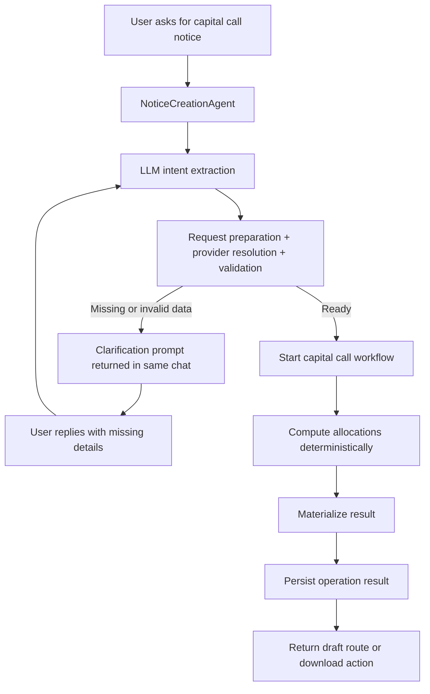
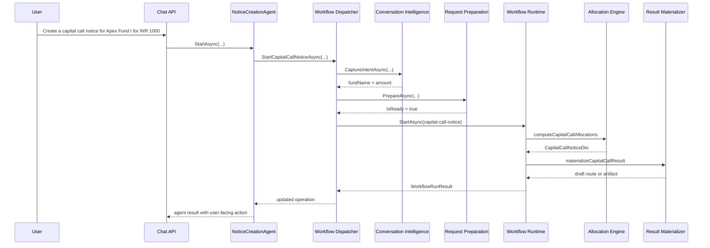
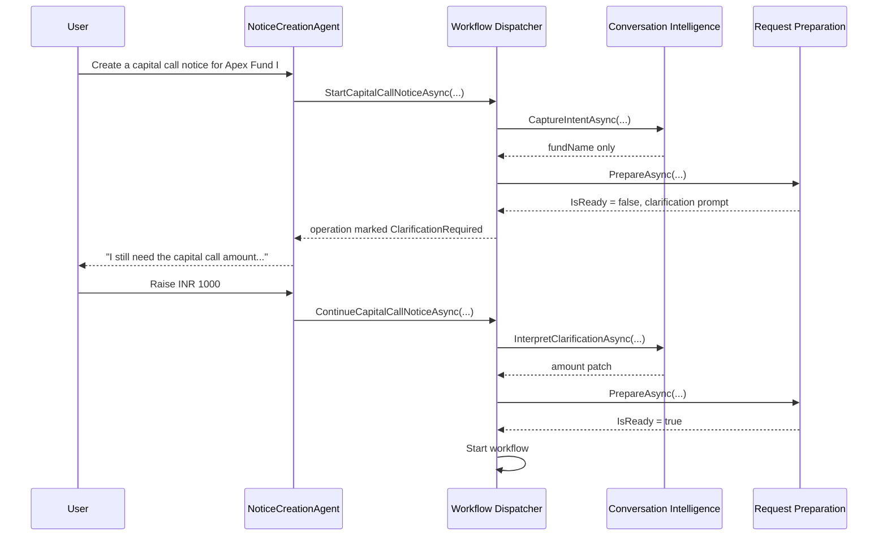
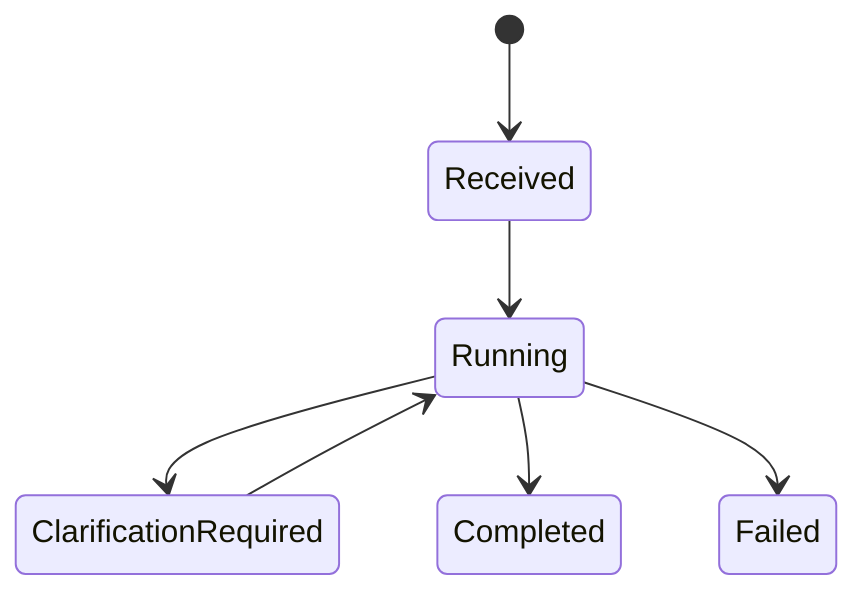

# Capital Call Notice Flow

This document explains how capital call notice creation currently works in the sample project.

It covers:

- happy path
- clarification loop
- attachment-backed flow
- validation and failure cases
- current workflow boundaries
- the main code paths involved

## 1. Purpose

The `Capital Call Notice` capability lets a user ask for a capital call notice in chat and receive one of:

- a draft notice route in SaaS mode
- a downloadable CSV artifact in attachment mode

The flow supports:

- partial user input in chat
- clarification in the same conversation thread
- recursive feeder-fund allocation
- FX conversion at feeder-fund boundaries
- deterministic rounding and residual handling

## 2. Important Current Design Note

The current implementation is split into two phases:

1. `Intake and clarification phase`
- runs in the agent + dispatcher + request-preparation layer
- uses LLM-assisted extraction plus deterministic validation
- loops in the same chat thread until enough data is available

2. `Execution phase`
- runs in a Microsoft Agent Framework code-first workflow graph
- performs deterministic allocation and result materialization

That means:

- clarification happens **before** the workflow starts
- the workflow currently handles:
  - compute allocations
  - materialize result

The current code-first workflow definition is in:

- [CapitalCallNoticeWorkflowDefinition.cs](/Users/naveenkumarpatil/Documents/orchestrator%20design/backend/src/Domain/ConversationalOrchestration.FundAdministration/Workflows/CapitalCallNoticeWorkflowDefinition.cs)

## 3. Inputs and Outputs

### Mandatory inputs

- `fundName`
- `capitalCallAmount`

### Optional inputs

- `noticeDate`
- explicit `partnerOverrides`

### Data source modes

- `SaaS`
  - fund and partner data comes from the SaaS-backed provider
- `AttachmentFile`
  - fund and partner data comes from an uploaded CSV
- `Mcp`
  - modeled in the abstraction, not implemented as a real integration yet

### Output modes

- `SaaS`
  - create draft notice and return route
- `AttachmentFile`
  - generate downloadable CSV output

## 4. High-Level Flow

## 5. Main Components

### Agent

- [NoticeCreationAgent.cs](/Users/naveenkumarpatil/Documents/orchestrator%20design/backend/src/Domain/ConversationalOrchestration.FundAdministration/Agents/NoticeCreationAgent.cs)

Responsibilities:

- starts the capital call flow
- continues it when clarification is required
- returns the right user-facing action after completion

### Workflow dispatcher

- [FundAdministrationWorkflowDispatcher.cs](/Users/naveenkumarpatil/Documents/orchestrator%20design/backend/src/Domain/ConversationalOrchestration.FundAdministration/Workflows/FundAdministrationWorkflowDispatcher.cs)

Responsibilities:

- orchestrates the pre-workflow clarification loop
- starts the workflow when the request is ready
- applies workflow results back onto the operation

### Conversation intelligence

- [CapitalCallConversationIntelligence.cs](/Users/naveenkumarpatil/Documents/orchestrator%20design/backend/src/Domain/ConversationalOrchestration.FundAdministration/CapitalCalls/CapitalCallConversationIntelligence.cs)

Responsibilities:

- extracts structured input from chat
- uses conversation compaction before LLM extraction

### Request preparation

- [CapitalCallExecutionServices.cs](/Users/naveenkumarpatil/Documents/orchestrator%20design/backend/src/Domain/ConversationalOrchestration.FundAdministration/CapitalCalls/CapitalCallExecutionServices.cs)

Specifically:

- `CapitalCallRequestPreparationService`

Responsibilities:

- merges user patch into request state
- resolves execution profile
- loads root fund
- validates feeder tree and percentages
- returns either:
  - `IsReady = false` with a clarification prompt
  - `IsReady = true` with normalized request state

### Allocation engine

Specifically:

- `CapitalCallAllocationEngine`

Responsibilities:

- recursively expands feeder structure
- converts amounts at feeder-fund boundaries
- computes partner allocations
- rounds to 2 decimals
- settles residual to the last sorted partner
- builds the `CapitalCallNoticeDto`

### Result materializer

Specifically:

- `CapitalCallResultMaterializer`

Responsibilities:

- persists final operation state
- produces:
  - draft route for SaaS
  - downloadable CSV artifact for attachment mode

## 6. Happy Path

### Example

User says:

`Create a capital call notice for Apex Fund I for INR 1000`

### Step-by-step

1. Chat message is routed to `NoticeCreationAgent`.
2. The agent asks the dispatcher to start capital-call intake.
3. `CapitalCallConversationIntelligence` extracts:
   - `fundName = Apex Fund I`
   - `capitalCallAmount = 1000`
4. `CapitalCallRequestPreparationService`:
   - merges extracted data into request state
   - resolves the execution profile
   - resolves the root fund
   - validates percentages and feeder tree
5. If valid, the dispatcher starts the capital-call workflow.
6. The code-first workflow graph invokes:
   - `computeCapitalCallAllocations`
   - `materializeCapitalCallResult`
7. The workflow result is applied back to the operation.
8. The agent returns:
   - `OpenPageWithPrefill` for SaaS draft mode
   - or download action for attachment mode

### Happy-path sequence

## 7. Clarification Path

### Example

User says:

`Create a capital call notice for Apex Fund I`

The amount is missing.

### Step-by-step

1. The agent starts the same intake flow.
2. LLM extraction captures only `fundName`.
3. Request preparation sees that `capitalCallAmount` is still missing.
4. The dispatcher marks the operation as:
   - `ClarificationRequired`
   - `CurrentStep = CaptureInputs`
5. The agent returns the clarification prompt in chat.
6. User replies:
   - `Raise INR 1000`
7. `ContinueAsync` is invoked on the same operation.
8. The new reply is interpreted as a patch.
9. The request state is merged and validated again.
10. Once ready, the workflow starts and continues through the happy path.

### Clarification sequence

## 8. Execution Profile Resolution

The current profile resolution rule is:

- if the tenant has a configured provider, use that provider profile
- otherwise, require an uploaded source file
- if no provider is configured and no file is present, return a clarification prompt

Important current behavior:

- the sample `tenant-demo` has a configured SaaS-style provider
- attachment mode currently expects a CSV for the actual sample implementation
- if a spreadsheet attachment exists but is not a CSV, the flow returns a clarification prompt

This logic lives in:

- `ResolveExecutionProfile(...)` in [CapitalCallExecutionServices.cs](/Users/naveenkumarpatil/Documents/orchestrator%20design/backend/src/Domain/ConversationalOrchestration.FundAdministration/CapitalCalls/CapitalCallExecutionServices.cs)

## 9. Validation Rules

The request preparation step validates the business graph before workflow execution starts.

Current validations include:

- missing `fundName`
- missing or non-positive `capitalCallAmount`
- unsupported attachment type in attachment mode
- root fund not found
- feeder depth greater than `10`
- feeder cycle detected
- fund has no partner commitment data
- partner commitment percentages do not sum to `100`
- feeder partner without child fund
- child feeder fund cannot be loaded

These checks happen in:

- `PrepareAsync(...)`
- `ValidateFundTreeAsync(...)`

## 10. Allocation Logic

The allocation engine is deterministic.

### Rules currently implemented

- partner allocation = `commitmentPercentage * amountToRaise / 100`
- partners are sorted alphabetically by `PartnerName`
- rounded to `2` decimal places
- residual balance is settled to the last partner after sorting
- feeder-fund allocations recurse into the child fund
- FX conversion happens when moving from parent fund currency to child fund currency

### Important current limitation

Leaf investor currency is not used for a final conversion step. The current implementation converts only at feeder-fund boundaries.

## 11. Output Shapes

The computation stage produces:

- `CapitalCallNoticeDto`

It contains:

- root fund information
- `FundBreakdowns`
- `LeafAllocations`

The materialization stage then produces one of:

- draft route
- file artifact + download route

## 12. Operation State Transitions

Typical operation states for capital call:

More specifically:

- initial agent start sets the operation to `Running`
- missing data moves it to `ClarificationRequired`
- clarification reply moves it back into intake processing
- ready request starts workflow execution
- successful materialization ends in `Completed`
- exceptions or workflow errors end in `Failed`

## 13. Data Sources

### SaaS sample provider

- [CapitalCallDataProviders.cs](/Users/naveenkumarpatil/Documents/orchestrator%20design/backend/src/Domain/ConversationalOrchestration.FundAdministration/CapitalCalls/CapitalCallDataProviders.cs)

Current sample data includes:

- `Apex Fund I`
- `North Star Feeder`
- `Horizon Feeder II`
- `Summit Growth Fund II`

### Attachment provider

The attachment-backed provider reads a CSV and builds in-memory fund snapshots for the flow.

Current expected columns include:

- `FundName`
- `FundCurrency`
- `PartnerName`
- `CommitmentPercentage`
- `PartnerCurrency`
- `PartnerType`
- `ChildFundName`

## 14. Agentic vs Deterministic Split

### Agentic parts

- `CaptureIntentAsync(...)`
- `InterpretClarificationAsync(...)`
- conversation history compaction before extraction

### Deterministic parts

- execution profile resolution
- request-state merge
- root fund resolution
- feeder validation
- recursion
- FX conversion
- rounding and residual settlement
- DTO generation
- final materialization

This is intentional so the financial math stays deterministic and auditable.

## 15. Current Logging Coverage

The flow now logs:

- chat intake and routing decision
- capital-call intake start and continue
- clarification required prompts
- request preparation summary
- validation failures
- workflow start and completion
- feeder expansion
- FX conversion
- final result materialization

Relevant logging points:

- [ChatOrchestratorService.cs](/Users/naveenkumarpatil/Documents/orchestrator%20design/backend/src/Framework/ConversationalOrchestration.Application/Conversations/ChatOrchestratorService.cs)
- [FundAdministrationWorkflowDispatcher.cs](/Users/naveenkumarpatil/Documents/orchestrator%20design/backend/src/Domain/ConversationalOrchestration.FundAdministration/Workflows/FundAdministrationWorkflowDispatcher.cs)
- [CapitalCallConversationIntelligence.cs](/Users/naveenkumarpatil/Documents/orchestrator%20design/backend/src/Domain/ConversationalOrchestration.FundAdministration/CapitalCalls/CapitalCallConversationIntelligence.cs)
- [CapitalCallExecutionServices.cs](/Users/naveenkumarpatil/Documents/orchestrator%20design/backend/src/Domain/ConversationalOrchestration.FundAdministration/CapitalCalls/CapitalCallExecutionServices.cs)
- [WorkflowRuntime.cs](/Users/naveenkumarpatil/Documents/orchestrator%20design/backend/src/Framework/ConversationalOrchestration.Infrastructure/Workflows/WorkflowRuntime.cs)

## 16. Relevant Code Map

If you want to trace the flow in code, the best reading order is:

1. [NoticeCreationAgent.cs](/Users/naveenkumarpatil/Documents/orchestrator%20design/backend/src/Domain/ConversationalOrchestration.FundAdministration/Agents/NoticeCreationAgent.cs)
2. [FundAdministrationWorkflowDispatcher.cs](/Users/naveenkumarpatil/Documents/orchestrator%20design/backend/src/Domain/ConversationalOrchestration.FundAdministration/Workflows/FundAdministrationWorkflowDispatcher.cs)
3. [CapitalCallConversationIntelligence.cs](/Users/naveenkumarpatil/Documents/orchestrator%20design/backend/src/Domain/ConversationalOrchestration.FundAdministration/CapitalCalls/CapitalCallConversationIntelligence.cs)
4. [CapitalCallExecutionServices.cs](/Users/naveenkumarpatil/Documents/orchestrator%20design/backend/src/Domain/ConversationalOrchestration.FundAdministration/CapitalCalls/CapitalCallExecutionServices.cs)
5. [CapitalCallNoticeWorkflowDefinition.cs](/Users/naveenkumarpatil/Documents/orchestrator%20design/backend/src/Domain/ConversationalOrchestration.FundAdministration/Workflows/CapitalCallNoticeWorkflowDefinition.cs)
6. [CapitalCallWorkflowTools.cs](/Users/naveenkumarpatil/Documents/orchestrator%20design/backend/src/Domain/ConversationalOrchestration.FundAdministration/CapitalCalls/CapitalCallWorkflowTools.cs)
7. [WorkflowRuntime.cs](/Users/naveenkumarpatil/Documents/orchestrator%20design/backend/src/Framework/ConversationalOrchestration.Infrastructure/Workflows/WorkflowRuntime.cs)

## 17. Future Improvements

Likely next improvements for this flow are:

- move clarification fully inside the workflow graph if desired
- add real MCP data provider and result sink
- support tenant-configured flexible spreadsheet mapping
- support richer override handling
- add per-allocation explanation metadata for audit and UI display
- add tests for feeder recursion, FX conversion, and residual settlement
