# Fund Orchestrator System Design

## 1. Purpose

This document describes the architecture for an AI-assisted fund administration orchestration layer built on top of a private equity SaaS product.

Primary users:

- Fund Accountants
- Fund Admins
- Internal support and operations teams

Primary product goal:

- Let users interact through an in-app chat surface
- Route each request to the right agent capability
- Execute simple inline actions and long-running workflows safely
- Keep all meaningful work auditable, tenant-scoped, and review-first

This repo contains a working sample implementation of that architecture using:

- `.NET 9`
- `MongoDB`
- `NServiceBus + RabbitMQ + MongoDB saga persistence`
- `React + Vite`

## 2. Design Principles

- Chat is the user-facing control surface, not the workflow source of truth.
- One conversation can contain many operations.
- Every meaningful unit of work gets its own `OperationId`.
- Sensitive or record-creating flows end in draft or review unless trivially reversible.
- Agents return structured actions, not only free-form text.
- Long-running workflows must survive delays, polling, retries, and human review.
- Tenant isolation is enforced in storage and APIs, not delegated to prompts.
- Auditability is built into every stage: message, routing, agent result, review, and workflow continuation.

## 3. Scope

### In scope

- Chat-driven request intake
- Agent routing
- Inline agent execution
- Saga-backed onboarding workflow
- Human review queue
- Conversation history
- Conversation thread projection for workflow updates
- Audit event persistence
- Tenant-scoped storage

### Example agents

- Notice Creation Helper
- Fund Onboarding Helper
- One Pager Generation Agent

### Out of scope in this sample

- Real authentication and authorization
- Real OCR/extraction integration
- Real LLM provider integration
- Real notification channels beyond polling/chat updates
- Production-grade deployment hardening

## 4. Core Domain Model

### Conversation

A conversation is the user-facing thread.

- `ConversationId`
- `TenantId`
- `Title`
- `LastFocusedOperationId`
- `CreatedAtUtc`
- `UpdatedAtUtc`

### Operation

An operation is the runtime unit of work.

- `OperationId`
- `ConversationId`
- `TenantId`
- `AgentId`
- `Status`
- `CurrentStep`
- `Summary`
- `PendingClarification`
- `ActiveReviewTaskId`
- `DataJson`

### Review Task

A review task is a human approval or correction checkpoint attached to an operation.

- `ReviewTaskId`
- `ConversationId`
- `OperationId`
- `TaskType`
- `Status`
- `ProposedPayloadJson`
- `FinalPayloadJson`
- `Notes`

### Conversation Message

A conversation message is the rendered chat projection.

- user prompt
- assistant reply
- workflow/system update
- review status update

### Audit Event

An append-only event emitted by user actions, agents, and workflows.

## 5. High-Level Architecture

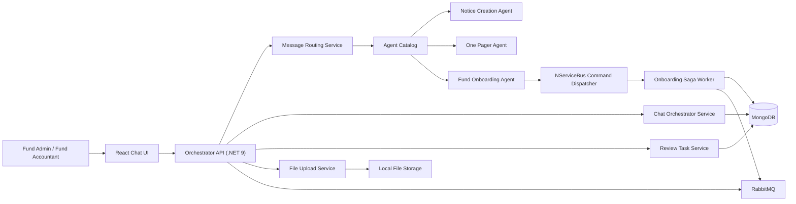

## 6. Component Responsibilities

### React UI

- chat composer
- message thread
- previous thread history
- active work list
- review queue
- polling conversation snapshots

### Orchestrator API

- accepts chat messages
- lists conversations
- returns conversation snapshots
- accepts review decisions
- accepts document uploads
- injects mocked tenant context

### Message Routing Service

Determines whether a message:

- continues an existing operation
- responds to a review task
- asks for status
- starts new work
- is ambiguous and needs clarification

### Agent Catalog

Registers supported capabilities and provides agent lookup/classification.

### Inline Agents

- `NoticeCreationAgent`
- `OnePagerAgent`

These use deterministic logic in the sample, but they fit the same contract as LLM-backed capabilities.

### Saga Workflow

`OnboardingSaga` manages:

- onboarding start
- wait for classification result
- create classification review
- continue after approval
- wait for extraction result
- create extraction review
- complete with draft creation

### MongoDB

Stores:

- conversations
- messages
- operations
- review tasks
- audit events
- file metadata

### RabbitMQ + NServiceBus

Handles:

- start workflow command
- review continuation command
- saga state progression

## 7. Execution Model

### Agent execution modes

- `InlineFunction`
- `SagaWorkflow`

### Current agent mapping

| Agent | Mode | Runtime shape |
| --- | --- | --- |
| Notice Creation Helper | `InlineFunction` | parse request, gather missing inputs, create draft action |
| One Pager Generation Agent | `InlineFunction` | parse target company/template, generate artifact action |
| Fund Onboarding Helper | `SagaWorkflow` | command dispatch, persisted saga state, review gates |

### Why not “everything is just a kernel function”

Simple functions are fine as an implementation detail. They are not enough as a platform boundary. The stable platform boundary is:

- conversation
- operation
- review task
- audit event
- workflow continuation

That shared runtime model keeps new agents pluggable and governable.

## 8. Message Routing Policy

Each incoming message must resolve to one of:

- `ContinueOperation`
- `RespondToReviewTask`
- `AskStatus`
- `StartNewOperation`
- `AmbiguousNeedClarification`

### Decision order

1. Match explicit operation reference
2. Match explicit or implied review decision
3. Match status query
4. Classify as new supported work
5. Route to clarification-required operation if one exists
6. Use referenced or single active operation
7. Ask for clarification if several interpretations remain

### Important behavior

One conversation can contain multiple active operations at the same time. A new request should not hijack an existing workflow unless the message clearly continues that workflow.

## 8.1 Scenario Catalog

The table below captures the expected behavior for the most important runtime situations in this product.

| Scenario | Expected system behavior | Persisted outcome |
| --- | --- | --- |
| User starts a brand-new request | Route to a supported agent and create a new operation | new conversation if needed, new operation, audit event |
| User sends message that fills missing fields | Continue the clarification-required operation | same operation updated, pending clarification cleared |
| User asks for notice creation with enough details | Complete inline and return draft action | operation completed, draft route stored |
| User asks for notice creation with missing details | Ask for more information | operation set to `ClarificationRequired` |
| User uploads docs and asks to create fund | Start onboarding workflow | operation created, workflow command published |
| Workflow reaches classification checkpoint | Create review task and system chat update | task stored, operation set to `WaitingForHumanReview` |
| Reviewer approves classification | Resume workflow and request extraction stage | review task approved, operation resumed, continuation command published |
| Workflow reaches extraction checkpoint | Create extraction review task | task stored, operation set to `WaitingForHumanReview` |
| Reviewer approves extraction | Complete operation and create draft-ready state | operation completed, route persisted, audit event appended |
| Reviewer rejects a task | Pause operation for correction | review task rejected, operation set to `ClarificationRequired` |
| User asks for status with one active operation | Return status for that operation | assistant/system message appended |
| User asks for status with multiple active operations | Return summary of all active work, or specific one if referenced | assistant/system message appended |
| User asks a different question mid-workflow | Start a new operation if the request is clearly new | second operation in same conversation |
| User says “approve it” and only one review is open | Auto-route to that review task | review decision stored, workflow may continue |
| User says “approve it” and multiple reviews are open | Ask for clarification | no workflow resumed until clarified |
| User opens a previous thread | Load summaries then full snapshot | conversation history list + selected snapshot |
| External or workflow stage fails | Mark operation as failed and surface message | operation set to `Failed`, audit event appended |
| User retries after failure | Start fresh work or explicit resume flow, depending on future policy | new operation or retried state |

## 9. State Machines

### Agent operation state machine

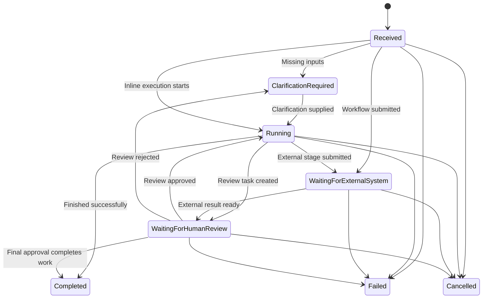

### Review task state machine

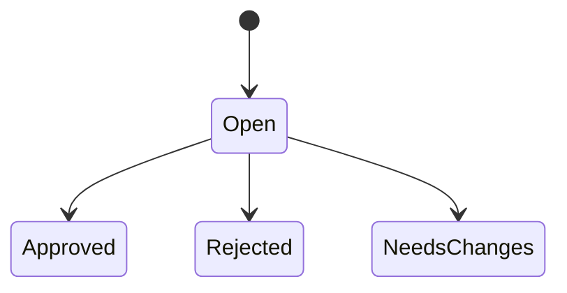

## 10. End-to-End Sequence Diagrams

### 10.1 Common chat-to-agent runtime

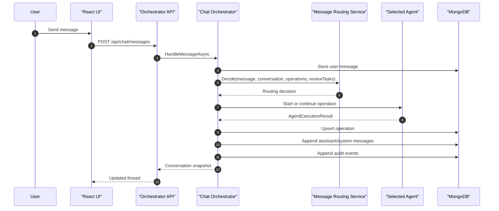

### 10.2 Notice Creation Helper

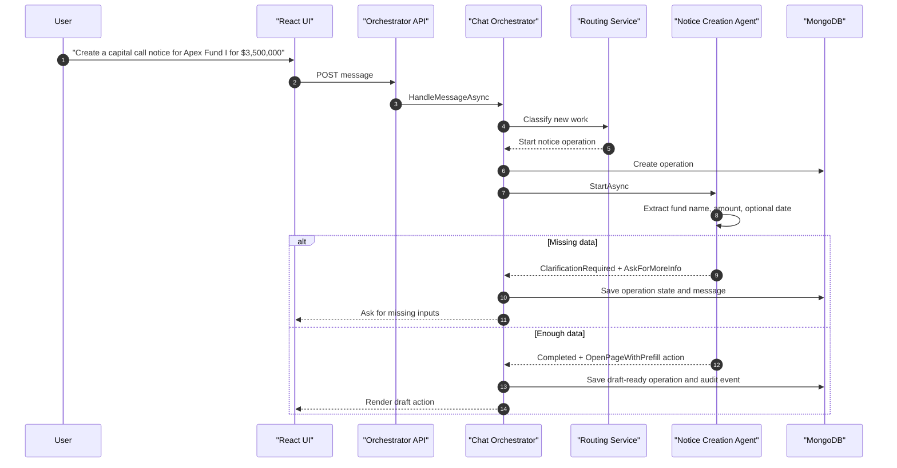

### 10.3 Fund Onboarding Helper with saga

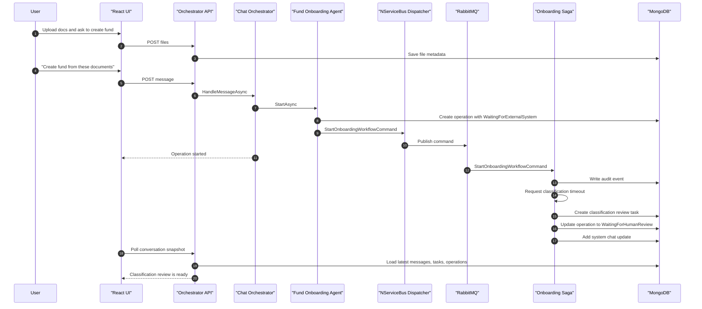

### 10.4 Review approval and workflow continuation

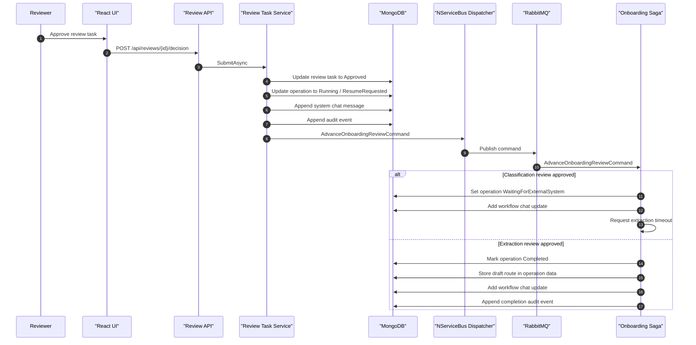

### 10.5 One Pager Generation Agent

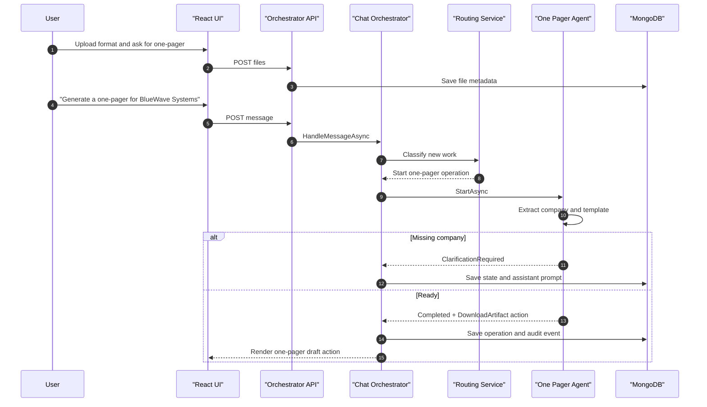

### 10.6 Same conversation, different request mid-workflow

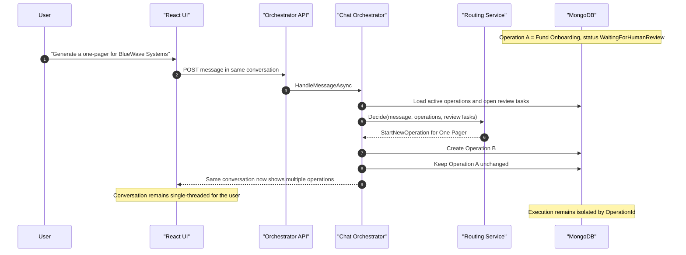

### 10.7 Previous conversation threads

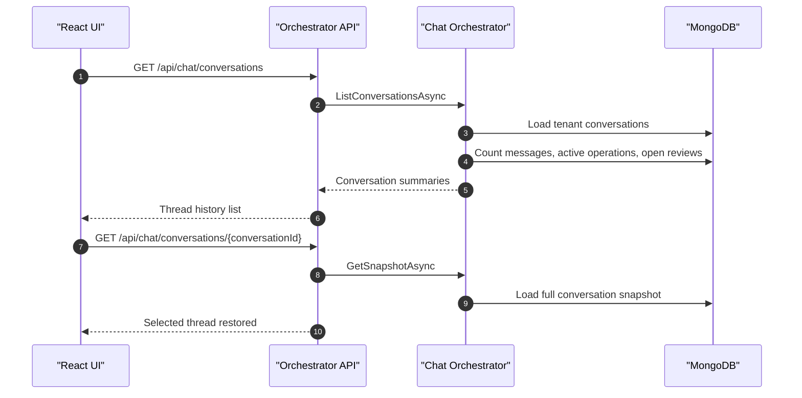

### 10.8 Clarification loop for inline agents

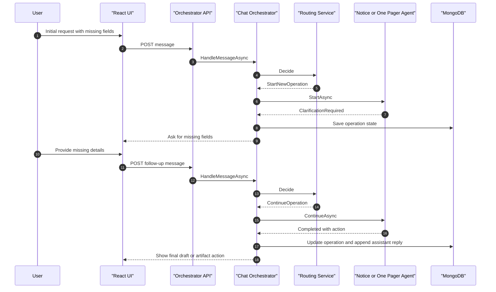

### 10.9 Ambiguous approval when multiple review tasks are open

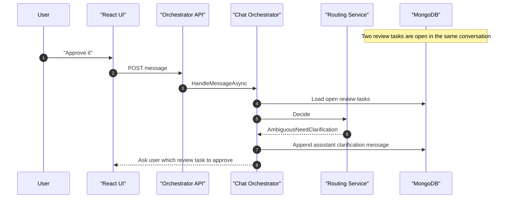

### 10.10 Status query while multiple operations are active

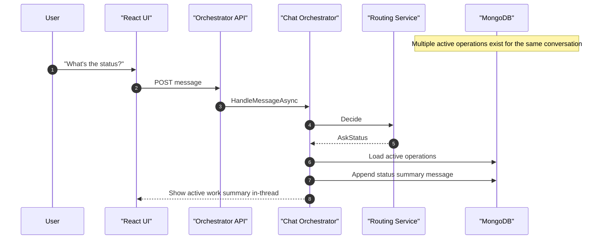

### 10.11 Review rejection path

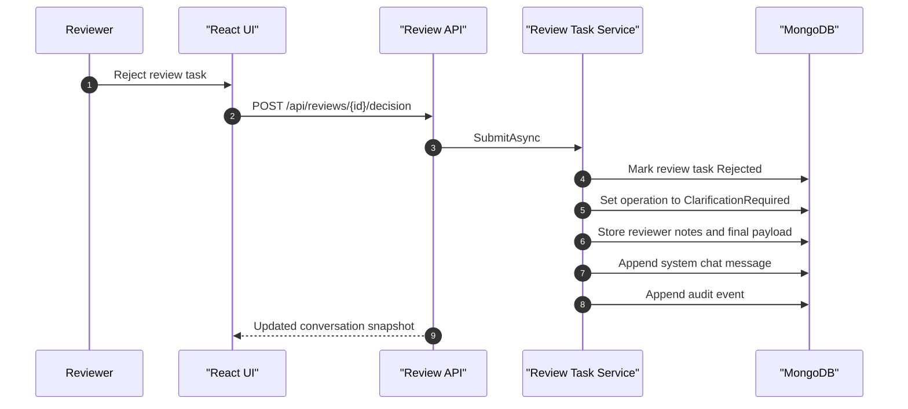

### 10.12 Failure and recovery path

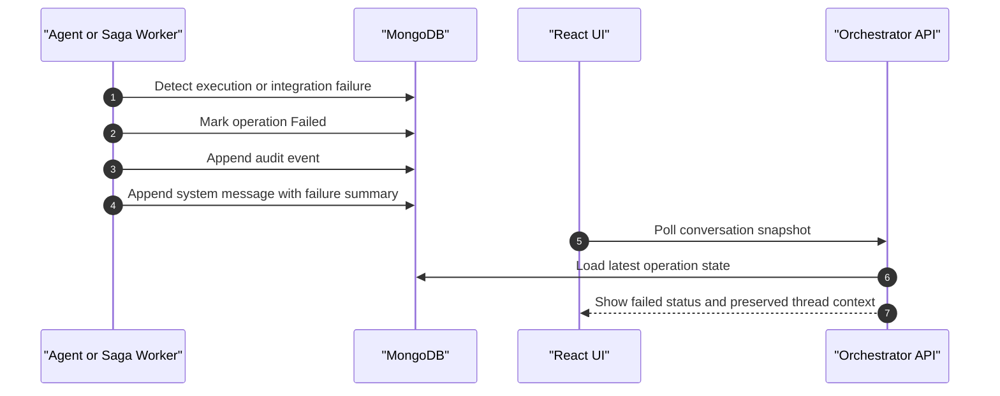

## 11. Conversation Projection Model

The workflow does not “continue from chat memory”. It continues from persisted workflow state.

Chat is updated as a projection of backend state changes:

- user sends prompt
- operation is created or updated
- review is created
- review is approved or rejected
- saga advances
- system appends a chat update

This separation gives:

- resumability
- cleaner retries
- stronger auditability
- support for multiple operations in one thread

## 12. Data Isolation and Auditability

### Tenant isolation

Every major entity is tenant-scoped:

- conversation
- message
- operation
- review task
- audit event
- file metadata

The sample uses mocked tenant headers, but the storage boundary is already tenant-aware.

### Audit coverage

Events should be emitted for:

- message received
- agent selected
- operation created
- clarification requested
- draft created
- workflow started
- review created
- review submitted
- workflow resumed
- workflow completed
- workflow failed
- ambiguity clarification requested
- status query answered

## 12.1 Failure Handling

### Inline agents

- validation failures move the operation to `ClarificationRequired` when the user can correct the issue
- unexpected exceptions should move the operation to `Failed`
- a failure message should be appended to the chat thread

### Saga workflows

- transient failures should be retried by the transport/handler policy
- non-recoverable failures should mark the operation as `Failed`
- review tasks should not be orphaned silently
- the conversation thread should show that the workflow stopped and needs intervention

### Recovery principle

Recovery should happen from persisted operation and review state, not by replaying free-form chat messages.

## 13. API Surface

### Chat

- `POST /api/chat/messages`
- `GET /api/chat/conversations/{conversationId}`
- `GET /api/chat/conversations`

### Review

- `POST /api/reviews/{reviewTaskId}/decision`

### Files

- `POST /api/files/upload`

## 14. Current Implementation Mapping

### Backend

- routing: `backend/src/FundOrchestrator.Application/Operations/MessageRoutingService.cs`
- orchestration: `backend/src/FundOrchestrator.Application/Conversations/ChatOrchestratorService.cs`
- review continuation: `backend/src/FundOrchestrator.Application/Reviews/ReviewTaskService.cs`
- agents: `backend/src/FundOrchestrator.Application/Agents/Agents.cs`
- saga: `backend/src/FundOrchestrator.Worker/Sagas/OnboardingSaga.cs`
- contracts: `backend/src/FundOrchestrator.Contracts`
- repositories: `backend/src/FundOrchestrator.Infrastructure/Repositories/MongoRepositories.cs`

### Frontend

- main app: `frontend/app/src/App.tsx`
- styling: `frontend/app/src/App.css`
- API client: `frontend/app/src/api.ts`
- DTO types: `frontend/app/src/types.ts`

## 15. Tradeoffs

### Why this works well now

- low user concurrency
- clear plugin path for new agents
- durable handling for long-running onboarding
- safe support for multiple operations in one conversation
- strong fit for review-first private equity workflows

### Known simplifications in this sample

- routing is rule-based, not model-based
- onboarding uses dummy timeouts instead of a real external OCR/extraction service
- file storage is local, not object storage
- polling is used instead of SignalR
- auth is mocked

## 16. Recommended Next Steps

- add real policy-based authorization
- replace dummy onboarding timeouts with external service callbacks or polling adapters
- add model gateway and agent-specific prompts where reasoning is needed
- move file storage to object storage
- add SignalR for real-time status updates
- introduce agent registry configuration so new agents can be enabled per tenant/environment
- add prompt/version tracking for LLM-backed agents
